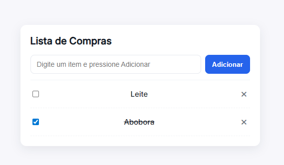

# 🛒 Lista de Compras

Um projeto básico em **HTML, CSS e JavaScript** para treinar lógica de programação e manipulação do DOM.

## 🚀 Funcionalidades

- Adicionar itens à lista digitando no campo de texto.  
- Bloqueio de números: só aceita letras no input.  
- Marcar item como **comprado** (risca o texto).  
- Remover itens da lista com um clique no botão **✖**.  
- Input limpa automaticamente após adicionar um item.

## 📂 Estrutura de Pastas

├── index.html # Estrutura principal
├── css/
│ └── style.css # Estilos (layout e responsividade)
└── js/
└── script.js # Lógica em JavaScript

## 🖼️ Preview

Exemplo de como a aplicação fica rodando:

## 🛠️ Como usar

1. Clone ou baixe o repositório.  
2. Abra o arquivo `index.html` no navegador.  
3. Digite um item no campo de texto e clique em **Adicionar**.  

## 💡 Melhorias possíveis

- Salvar itens no **localStorage** para não perder ao atualizar a página.  
- Permitir adicionar pressionando **Enter**.  
- Mensagens personalizadas sem `alert()`, usando elementos HTML.  
- Ordenar os itens (ex: comprados no final).  

---

Projeto simples, mas ótimo para treinar **manipulação de elementos, eventos e boas práticas de JavaScript**.  

